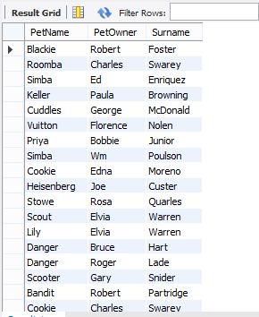

# Vetenary_Clinic_Data


## Overview

I was required to assist a vertinary clinic make sense of their data. Their data is dispersed accross multiple CSV files and they needed me to perform the following analytics

1. Extract information on pet names and owners' names sids by side.
2. Find out which pets from this clinic had precedures performed.
3. Match up all procedures performed to the descriptions.
4. Extract a table of individual costs (procedure prices) incurred by owners of pets from the clinic in question (the table should have owner and procedure price side by side).

## Tool used
- MySQL

## Skills Demostrated
- Data extraction
- Joining
- Aggregation.

Here's a structured approach applied in accomplishing each of the tasks:

### Task 1: Extract Information on Pet Names and Owners' Names Side by Side
```sql
select pets.Name as "PetName", petowners.Name as "PetOwner", petowners.Surname from pets
inner join petowners
on pets.OwnerID = petowners.OwnerID;
```


This query joins the pets and owners tables to retrieve pet names and their corresponding owners' names side by side.

### Task 2: Find out Which Pets Had Procedures Performed

Query to Find Pets with Procedures:
```sql
select distinct pets.Name, pets.Kind, petprocedureshistory.ProcedureType from pets
inner join petprocedureshistory
on pets.PetID = petprocedureshistory.PetID;
```

This query retrieves distinct pet names from the pets table that have entries in the procedures table.

### Task 3: Match Up All Procedures Performed to Their Descriptions
To match procedures performed to their descriptions, I simply queried the procedures table:

```sql
select ProcedureType, Description from petproceduresdetails;
```

This query will give you a list of all procedures performed along with their descriptions.


## Task 4: Extract a Table of Individual Costs (Procedure Prices) Incurred by Owners
Assuming you want to extract a table showing owners and the costs incurred for procedures for their pets.

Query to Calculate Procedure Costs Per Owner:

```sql
select petowners.Name as 'PetOwner', pets.Name as 'PetNanme', pets.Kind, procedureshistory.ProcedureType, proceduresdetails.Price as 'Cost'  from petowners
inner join pets on
pets.OwnerID = petowners.OwnerID
inner join procedureshistory on 
procedureshistory.PetID = pets.PetID
inner join proceduresdetails on
proceduresdetails.ProcedureSubCode = procedureshistory.ProcedureSubCode;
```

This query joins the owners, pets, and procedures tables, the costs of procedures for each owner's pets.


